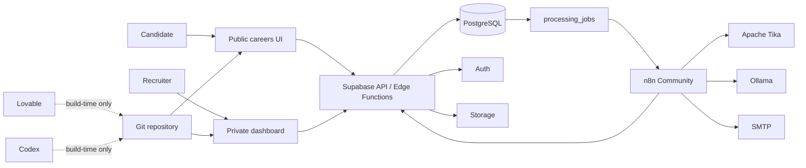
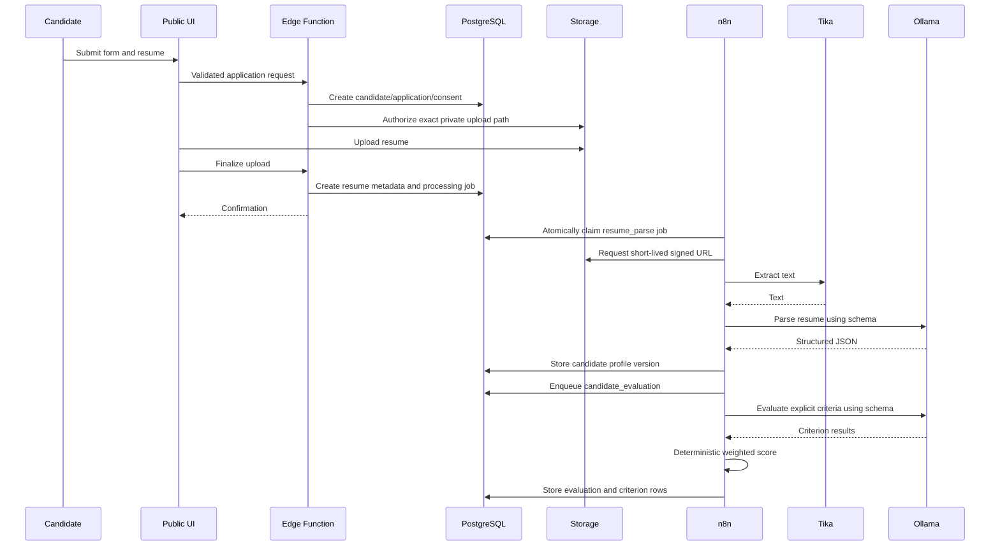

# 02 — System architecture

## Context diagram

## Runtime boundaries

### Browser

Owns rendering, form interaction, authenticated user session, accessible feedback, and calls to approved Supabase/RPC/Edge contracts. It does not own authorization, canonical state, secrets, weighted scoring, or processing retries.

### Supabase

Owns authentication, canonical relational state, row authorization, object metadata, private storage, controlled functions, public Edge endpoints, and durable processing jobs.

### n8n

Owns orchestration of asynchronous steps. It claims a job, retrieves required data, calls Tika/Ollama/SMTP, validates responses, writes results, records activity, and updates the job. It does not become the source of truth.

### Apache Tika

Accepts an internal document request and returns extracted text/metadata. It must not be publicly exposed. Input is untrusted and resource limits are required.

### Ollama

Runs selected local models behind an adapter. The adapter accepts task input and an expected JSON Schema. Model-specific request details do not leak through the domain layer.

### SMTP

Sends approved email. Credentials remain server-side. A provider message identifier is stored when available.

## Main application flow

## Data ownership

- Auth credentials and sessions: Supabase Auth.
- Product user profile: `profiles`.
- Tenant membership and role: `company_members`.
- Canonical business state: PostgreSQL tables.
- Resume bytes: private Supabase Storage.
- Resume metadata and extracted text: PostgreSQL, subject to retention policy.
- Workflow execution data: n8n operational storage, minimized; canonical status remains in PostgreSQL.
- AI model files: Ollama runtime.

## Deployment topology

For V0, a single environment may host the frontend, n8n, Tika, and Ollama with Supabase managed or local/self-hosted. Keep service networking private where possible. Production must separate public ingress from internal services and must not expose Tika, Ollama, the database, or n8n editor endpoints to unauthenticated public traffic.

## Scalability posture

V0 optimizes for correctness and portability, not maximum throughput. The `processing_jobs` abstraction allows additional n8n workers later. Database indexes prioritize job claims, tenant/job candidate lists, evaluation history, message status, and activity history. Avoid speculative GIN indexes until query evidence exists.
