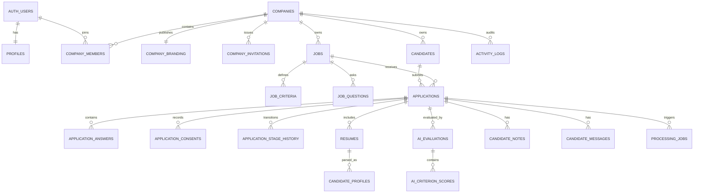

# 04 — Domain and data model

The canonical field-level model is in `database/data-dictionary.md`.

## Aggregates

### Company

`companies` stores internal organization identity. `company_branding` stores publishable fields and the public slug. `company_members` maps users to company-scoped roles. `company_invitations` supports pre-registration invitations with hashed tokens.

### Job

`jobs` is the job aggregate root. `job_criteria` defines explicit weighted evaluation criteria. `job_questions` defines public application questions. Publication is controlled by `publish_job()` because it must validate the aggregate atomically.

### Candidate and application

A `candidate` represents a person within a company. An `application` represents that candidate applying to one job and stores name/email/phone snapshots. This distinction preserves application history even when the candidate record changes.

### Resume and candidate profile

A `resume` belongs to an application, not directly to a global profile, because the submitted document is part of the application evidence and may differ across jobs or over time. `candidate_profiles` are versioned structured interpretations of a specific resume/application context.

### Evaluation

`ai_evaluations` is versioned and references the application, job, and candidate profile version. `ai_criterion_scores` stores each criterion result plus criterion name/weight snapshots so historical explanations remain stable after job edits.

### Recruiting operations

`application_stage_history` stores pipeline transitions. `candidate_notes` stores private collaboration notes. `candidate_messages` stores drafts and delivery state. `activity_logs` stores sanitized audit events. `processing_jobs` stores durable asynchronous work.

## Entity relationships

## Invariants

- Candidate uniqueness: `(company_id, normalized_email)`.
- Application uniqueness: `(company_id, job_id, applicant_email_normalized)`.
- Job slug uniqueness: `(company_id, slug)`.
- Public company slug uniqueness: global `company_branding.public_slug`.
- Active membership uniqueness: one membership record per `(company_id, user_id)`.
- Resume V0: one current resume per application; future versioning may replace this constraint.
- Candidate profile versions: unique `(application_id, version)`.
- AI idempotency: unique `(company_id, idempotency_key)`.
- Message idempotency: unique `(company_id, idempotency_key)`.
- Processing job idempotency: unique `(company_id, idempotency_key)`.
- Criterion score uniqueness: `(ai_evaluation_id, job_criterion_id)`.

## Tenant-safe references

For critical relationships, parent tables expose unique `(company_id, id)` keys and children reference both values. This prevents accidental cross-company references even in privileged code that bypasses RLS.

## Versioning policy

- Prompts carry a semantic or dated `prompt_version`.
- Candidate profiles increment `version` and are not silently overwritten.
- Evaluations reference a profile version and capture `criteria_version`.
- Criterion name and weight are snapshotted on score rows.
- Reprocessing creates a new result unless an identical idempotency key already completed.
