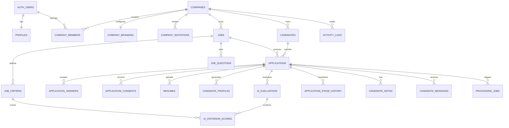

# Modelo de datos propuesto para Hirefly

El modelo debe ser **multi-tenant**, con Supabase Auth como fuente canónica de identidad, PostgreSQL como fuente oficial del estado, Storage para documentos y `processing_jobs` como cola lógica para n8n. Esto mantiene el aislamiento por empresa, la trazabilidad de evaluaciones y el procesamiento asíncrono definidos para el MVP. fileciteturn0file0

Supabase Auth almacena usuarios en el esquema `auth`; la aplicación debe referenciar `auth.users.id` desde sus propias tablas. Las contraseñas, sesiones, identidades y tokens no deben replicarse en `public`. ([supabase.com](https://supabase.com/docs/guides/auth?utm_source=chatgpt.com))

## 1. Principios estructurales

1. Toda información perteneciente a una empresa incluye `company_id`.
2. `auth.users` representa la identidad; `profiles` representa información de producto.
3. Los roles viven en `company_members`, porque un usuario puede pertenecer a varias empresas con roles distintos.
4. Las relaciones críticas usan claves foráneas compuestas con `company_id` para impedir referencias cruzadas entre tenants.
5. Los candidatos son únicos por empresa, no globalmente.
6. Las aplicaciones guardan un snapshot del correo del candidato.
7. Los datos públicos se exponen mediante RPC o Edge Functions, no dando acceso anónimo indiscriminado a tablas privadas.
8. Los resultados de IA se versionan y nunca sobrescriben evaluaciones anteriores.
9. Las operaciones asíncronas deben ser idempotentes.

## 2. Diagrama principal



## 3. Identidad, empresas y membresías

### `profiles`

Extensión de `auth.users`.

| Campo | Tipo | Regla |
|---|---|---|
| `id` | `uuid` | PK y FK a `auth.users(id)` |
| `full_name` | `text` | Obligatorio |
| `avatar_path` | `text` | Nullable |
| `locale` | `text` | Default `es-CO` |
| `timezone` | `text` | Default `America/Bogota` |
| `onboarding_completed_at` | `timestamptz` | Nullable |
| `created_at` | `timestamptz` | Default `now()` |
| `updated_at` | `timestamptz` | Default `now()` |

El correo puede mostrarse desde Auth o conservarse como caché no autoritativa. No debe usarse para autorización.

### `companies`

Contiene información interna de la organización.

| Campo | Tipo | Regla |
|---|---|---|
| `id` | `uuid` | PK |
| `legal_name` | `text` | Obligatorio |
| `internal_name` | `text` | Obligatorio |
| `status` | `company_status` | `active`, `suspended`, `archived` |
| `default_timezone` | `text` | Default `America/Bogota` |
| `created_by` | `uuid` | FK a `auth.users` |
| `created_at` | `timestamptz` | |
| `updated_at` | `timestamptz` | |

### `company_branding`

Separar branding de `companies` facilita controlar qué información puede mostrarse públicamente.

| Campo | Tipo | Regla |
|---|---|---|
| `company_id` | `uuid` | PK y FK a `companies` |
| `public_slug` | `citext` | Unique global |
| `display_name` | `text` | |
| `description` | `text` | |
| `logo_path` | `text` | |
| `primary_color` | `text` | Check hexadecimal |
| `secondary_color` | `text` | Check hexadecimal |
| `website_url` | `text` | |
| `public_contact_email` | `citext` | Nullable |
| `careers_published` | `boolean` | Default `false` |
| `seo_title` | `text` | Nullable |
| `seo_description` | `text` | Nullable |
| `created_at` | `timestamptz` | |
| `updated_at` | `timestamptz` | |

### `company_members`

| Campo | Tipo | Regla |
|---|---|---|
| `id` | `uuid` | PK |
| `company_id` | `uuid` | FK |
| `user_id` | `uuid` | FK a `auth.users` |
| `role` | `member_role` | `owner`, `admin`, `recruiter`, `viewer` |
| `status` | `member_status` | `invited`, `active`, `suspended` |
| `invited_by` | `uuid` | Nullable |
| `joined_at` | `timestamptz` | Nullable |
| `created_at` | `timestamptz` | |

Restricción:

```sql id="moecvz"
unique (company_id, user_id)
```

### `company_invitations`

Permite invitar usuarios que todavía no están registrados.

Campos principales:

```text id="lyitab"
id
company_id
email
role
token_hash
status
invited_by
expires_at
accepted_at
created_at
```

Nunca debe guardarse el token original; solamente un hash.

## 4. Vacantes

### `jobs`

| Campo | Tipo |
|---|---|
| `id` | `uuid` |
| `company_id` | `uuid` |
| `slug` | `citext` |
| `title` | `text` |
| `department` | `text` |
| `location` | `text` |
| `country_code` | `char(2)` |
| `work_mode` | `work_mode` |
| `contract_type` | `contract_type` |
| `description` | `text` |
| `responsibilities` | `text` |
| `requirements` | `text` |
| `minimum_experience_months` | `integer` |
| `salary_min` | `numeric(14,2)` |
| `salary_max` | `numeric(14,2)` |
| `salary_currency` | `char(3)` |
| `show_salary` | `boolean` |
| `status` | `job_status` |
| `published_at` | `timestamptz` |
| `closes_at` | `timestamptz` |
| `created_by` | `uuid` |
| `updated_by` | `uuid` |
| `created_at` | `timestamptz` |
| `updated_at` | `timestamptz` |

Restricciones:

```sql id="opkjcp"
unique (company_id, slug)
check (salary_min is null or salary_min >= 0)
check (salary_max is null or salary_max >= salary_min)
check (minimum_experience_months is null or minimum_experience_months >= 0)
```

Estados:

```text id="g2wpi6"
draft
published
paused
closed
archived
```

### `job_criteria`

```text id="nqrqje"
id
company_id
job_id
name
description
criterion_type
is_required
weight
evidence_description
fulfillment_condition
sort_order
is_active
created_at
updated_at
```

Reglas:

```sql id="kxdk1i"
check (weight > 0 and weight <= 100)
unique (job_id, sort_order)
```

No recomiendo exigir que la suma sea 100 durante cada edición: un borrador puede estar temporalmente incompleto. La función transaccional `publish_job()` debe validar:

- Entre 4 y 8 criterios activos.
- Suma de pesos exactamente igual a 100.
- Título, descripción y ubicación válidos.
- Al menos un criterio obligatorio o una decisión explícita de no usar criterios obligatorios.

### `job_questions`

```text id="a3bedc"
id
company_id
job_id
question
answer_type
is_required
options jsonb
sort_order
is_active
created_at
updated_at
```

Para el V0, `options jsonb` es suficiente para selecciones simples y múltiples.

## 5. Candidatos y aplicaciones

### `candidates`

Un candidato representa una persona dentro de una empresa.

| Campo | Tipo |
|---|---|
| `id` | `uuid` |
| `company_id` | `uuid` |
| `full_name` | `text` |
| `email` | `citext` |
| `normalized_email` | `text generated` |
| `phone` | `text` |
| `city` | `text` |
| `country_code` | `char(2)` |
| `linkedin_url` | `text` |
| `portfolio_url` | `text` |
| `created_at` | `timestamptz` |
| `updated_at` | `timestamptz` |

Restricción:

```sql id="nbeims"
unique (company_id, normalized_email)
```

Un mismo correo sí puede existir en empresas diferentes, como establece el alcance original. fileciteturn1file0

### `applications`

```text id="wb3c9y"
id
company_id
candidate_id
job_id
applicant_name
applicant_email
applicant_email_normalized
applicant_phone
stage
status
source
applied_at
last_activity_at
recruiter_score
recruiter_score_reason
recruiter_score_by
recruiter_scored_at
withdrawn_at
created_at
updated_at
```

La aplicación debe guardar snapshots de nombre, correo y teléfono. Así, una edición posterior del candidato no altera los datos con los que aplicó.

Restricción para duplicados:

```sql id="661rbq"
unique (company_id, job_id, applicant_email_normalized)
```

Este enfoque corrige una inconsistencia del modelo inicial: la restricción propuesta utiliza `normalized_email`, pero ese campo se encontraba en `candidates`, no en `applications`. fileciteturn1file0

### Integridad multi-tenant

Además de las claves foráneas normales, recomiendo claves compuestas:

```sql id="2dz60u"
alter table jobs
  add constraint jobs_company_id_id_unique
  unique (company_id, id);

alter table candidates
  add constraint candidates_company_id_id_unique
  unique (company_id, id);

alter table applications
  add constraint applications_job_same_company_fk
  foreign key (company_id, job_id)
  references jobs (company_id, id);

alter table applications
  add constraint applications_candidate_same_company_fk
  foreign key (company_id, candidate_id)
  references candidates (company_id, id);
```

Esto evita que una aplicación de la empresa A apunte accidentalmente a una vacante o candidato de la empresa B, incluso cuando una operación administrativa omita el filtro de tenant.

### `application_answers`

```text id="i77e4q"
id
company_id
application_id
job_question_id
answer_text
answer_json
created_at
```

Debe existir una restricción:

```sql id="r4ym0s"
unique (application_id, job_question_id)
```

### `application_consents`

```text id="k2sdo1"
id
company_id
application_id
consent_type
policy_version
accepted
accepted_at
ip_hash
user_agent
created_at
```

Separar consentimientos permite mantener historial cuando cambie la política de privacidad.

### `application_stage_history`

```text id="qcc8vf"
id
company_id
application_id
from_stage
to_stage
changed_by
reason
created_at
```

Aunque `activity_logs` registre la acción, esta tabla permite consultar el pipeline históricamente sin interpretar JSON.

## 6. CV y perfil estructurado

### `resumes`

```text id="yvbztg"
id
company_id
application_id
storage_path
original_filename
mime_type
file_size_bytes
checksum_sha256
extracted_text
parsing_status
parsing_error
uploaded_at
parsed_at
created_at
updated_at
```

Para el V0 puede usarse:

```sql id="4jgz2x"
unique (application_id)
```

Si más adelante se permiten reemplazos, debe agregarse `version` e `is_current`.

### `candidate_profiles`

Cada procesamiento debe crear una versión, no sobrescribir necesariamente el resultado anterior.

```text id="4nz0df"
id
company_id
application_id
resume_id
version
headline
summary
experience jsonb
education jsonb
skills jsonb
languages jsonb
certifications jsonb
links jsonb
total_experience_months
location
missing_information jsonb
warnings jsonb
parser_provider
parser_model
parser_prompt_version
raw_result jsonb
status
created_at
```

Restricción:

```sql id="mlwwlx"
unique (application_id, version)
```

## 7. Evaluaciones de IA

### `ai_evaluations`

```text id="em87z3"
id
company_id
application_id
job_id
candidate_profile_id
model_provider
model_name
prompt_version
criteria_version
idempotency_key
total_score
recommendation
summary
strengths jsonb
gaps jsonb
missing_information jsonb
interview_questions jsonb
warnings jsonb
raw_result jsonb
status
started_at
completed_at
created_at
```

Restricciones:

```sql id="dl4zfl"
unique (company_id, idempotency_key)
check (total_score is null or total_score between 0 and 100)
```

La suma ponderada debe calcularse en código o SQL determinístico, nunca confiarse al modelo, tal como se define en el diseño del workflow. fileciteturn1file3

### `ai_criterion_scores`

```text id="s9k3kk"
id
company_id
ai_evaluation_id
job_criterion_id
criterion_name_snapshot
criterion_weight_snapshot
status
score
confidence
evidence jsonb
explanation
created_at
```

Checks:

```sql id="5ppbgg"
check (score between 0 and 100)
check (confidence between 0 and 1)
unique (ai_evaluation_id, job_criterion_id)
```

Los snapshots de nombre y peso conservan la explicación histórica aunque la vacante sea editada después.

## 8. Colaboración y comunicaciones

### `candidate_notes`

```text id="shok8r"
id
company_id
application_id
user_id
content
is_private
created_at
updated_at
```

En el V0, `is_private` puede mantenerse siempre en `true`, pero dejar el campo evita una migración posterior.

### `candidate_messages`

```text id="cb9p3m"
id
company_id
application_id
created_by
channel
recipient
subject
content
status
provider_message_id
approved_by
approved_at
sent_at
error
idempotency_key
created_at
updated_at
```

Restricción:

```sql id="skyj2c"
unique (company_id, idempotency_key)
```

Estados:

```text id="n32dyq"
draft
approved
queued
sent
failed
cancelled
```

## 9. Auditoría y procesamiento asíncrono

### `activity_logs`

```text id="0ox8ep"
id
company_id
actor_user_id
actor_type
entity_type
entity_id
action
metadata jsonb
request_id
ip_hash
created_at
```

No deben guardarse en `metadata`:

- Texto completo del CV.
- Tokens.
- Secretos.
- Contraseñas.
- Contenido completo de prompts con información personal innecesaria.

### `processing_jobs`

```text id="aeppzy"
id
company_id
application_id
job_type
status
priority
attempts
max_attempts
available_at
locked_at
locked_by
lock_expires_at
idempotency_key
payload jsonb
result jsonb
last_error
started_at
completed_at
created_at
updated_at
```

Restricciones e índices:

```sql id="8uk7oe"
unique (company_id, idempotency_key);

create index processing_jobs_claim_idx
on processing_jobs (priority desc, available_at, created_at)
where status = 'pending';
```

La reclamación debe hacerse mediante una función transaccional con `FOR UPDATE SKIP LOCKED`. El documento del proyecto ya define esta tabla como fuente durable de trabajos y exige recuperación de locks e idempotencia. fileciteturn1file2turn1file3

Supabase dispone actualmente de una solución de colas basada en `pgmq`, pero conservar `processing_jobs` en el V0 sigue siendo razonable porque ofrece una representación de dominio auditable, portable y directamente compatible con n8n. Una migración posterior podría usar Supabase Queues como transporte sin eliminar el registro de negocio. ([supabase.com](https://supabase.com/docs/guides/queues?utm_source=chatgpt.com))

## 10. Autenticación y onboarding

Flujo recomendado:

1. El usuario se registra mediante Supabase Auth.
2. Un trigger `after insert on auth.users` crea `profiles`.
3. El frontend llama a `create_company()`.
4. La función crea en una única transacción:
   - `companies`
   - `company_branding`
   - `company_members` con rol `owner`
   - `activity_logs`
5. Las invitaciones posteriores se gestionan mediante una Edge Function administrativa.
6. Al aceptar la invitación se activa o crea la membresía.

No guardaría los roles únicamente dentro de `user_metadata`: Supabase advierte que esa metadata puede ser modificada por el propio usuario. Para autorización, la tabla `company_members` es la fuente correcta; `raw_app_meta_data` podría usarse solamente como caché o para optimizaciones muy controladas. ([supabase.com](https://supabase.com/docs/guides/database/postgres/row-level-security?utm_source=chatgpt.com))

## 11. Modelo de permisos

Supabase permite combinar el JWT de Auth con políticas RLS directamente en PostgreSQL; las tablas expuestas deben tener RLS habilitado explícitamente cuando se crean mediante migraciones SQL. ([supabase.com](https://supabase.com/docs/guides/database/postgres/row-level-security?utm_source=chatgpt.com))

### Roles de Hirefly

| Acción | Owner | Admin | Recruiter | Viewer |
|---|---:|---:|---:|---:|
| Ver información de empresa | Sí | Sí | Sí | Sí |
| Editar branding | Sí | Sí | No | No |
| Gestionar miembros | Sí | Sí | No | No |
| Crear/editar vacantes | Sí | Sí | Sí | No |
| Ver candidatos | Sí | Sí | Sí | Sí |
| Cambiar pipeline | Sí | Sí | Sí | No |
| Agregar notas | Sí | Sí | Sí | No |
| Aprobar mensajes | Sí | Sí | Sí | No |
| Archivar empresa | Sí | No | No | No |

### Funciones auxiliares

```sql id="8jrmc5"
private.is_active_company_member(company_id uuid)
private.has_company_role(company_id uuid, roles member_role[])
private.can_manage_company(company_id uuid)
private.can_recruit(company_id uuid)
```

Ejemplo conceptual:

```sql id="yktxoj"
create policy "Members can read applications"
on public.applications
for select
to authenticated
using (
  private.is_active_company_member(company_id)
);
```

Las funciones `security definer` deben tener un `search_path` fijo, permisos mínimos y revisión explícita, porque amplían los privilegios del usuario que las invoca. ([supabase.com](https://supabase.com/docs/guides/troubleshooting/do-i-need-to-expose-security-definer-functions-in-row-level-security-policies-iI0uOw?utm_source=chatgpt.com))

## 12. Acceso público

El rol `anon` no debe poder consultar directamente:

```text id="4ph3s8"
candidates
applications
resumes
candidate_profiles
ai_evaluations
ai_criterion_scores
candidate_notes
candidate_messages
activity_logs
processing_jobs
company_members
```

Operaciones públicas:

```text id="570nel"
get_public_career_site(company_slug)
list_public_jobs(company_slug, filters)
get_public_job(company_slug, job_slug)
submit_public_application(...)
```

Recomiendo implementar `submit_public_application` mediante una **Supabase Edge Function**, porque debe combinar:

- Validación y sanitización.
- CAPTCHA o protección antiabuso.
- Prevención de duplicados.
- Creación transaccional del candidato y la aplicación.
- Generación de ruta o token de subida.
- Finalización del CV.
- Creación de `processing_jobs`.
- Confirmación de aplicación.

## 13. Supabase Storage

Buckets:

### `company-assets`

- Lectura pública.
- Escritura solamente para `owner` y `admin`.
- Ruta:

```text id="un27ur"
{company_id}/branding/{uuid}.{extension}
```

### `resumes`

- Bucket privado.
- Sin listado público.
- Subida pública únicamente mediante token firmado para una ruta exacta.
- Lectura mediante URL firmada de corta duración.
- Ruta:

```text id="73zwhd"
{company_id}/{job_id}/{application_id}/{uuid}.{extension}
```

Supabase Storage aplica las políticas sobre `storage.objects`; los buckets privados quedan sujetos a control de acceso y pueden restringir tamaño y MIME permitidos. ([supabase.com](https://supabase.com/docs/guides/storage/security/access-control?utm_source=chatgpt.com))

La credencial secreta utilizada por n8n puede saltarse RLS y por eso debe existir exclusivamente en infraestructura segura, nunca en Lovable, React o el navegador. ([supabase.com](https://supabase.com/docs/guides/auth/users?utm_source=chatgpt.com))

## 14. Índices esenciales

```sql id="wygxfv"
create index company_members_user_idx
  on company_members (user_id, status, company_id);

create index jobs_company_status_idx
  on jobs (company_id, status, published_at desc);

create index applications_job_pipeline_idx
  on applications (company_id, job_id, stage, applied_at desc);

create index applications_candidate_idx
  on applications (company_id, candidate_id, applied_at desc);

create index ai_evaluations_application_idx
  on ai_evaluations (company_id, application_id, created_at desc);

create index activity_logs_entity_idx
  on activity_logs (
    company_id,
    entity_type,
    entity_id,
    created_at desc
  );

create index candidate_messages_status_idx
  on candidate_messages (company_id, status, created_at);
```

Los índices GIN sobre `candidate_profiles.skills` o `experience` deberían agregarse solamente cuando exista una consulta real que los justifique.

## 15. Orden de migraciones

```text id="l1ukrf"
001_extensions_and_types.sql
002_profiles_and_auth_trigger.sql
003_companies_and_memberships.sql
004_jobs_and_criteria.sql
005_candidates_and_applications.sql
006_resumes_and_candidate_profiles.sql
007_ai_evaluations.sql
008_notes_messages_and_activity.sql
009_processing_jobs.sql
010_rls_helpers.sql
011_rls_policies.sql
012_storage_policies.sql
013_public_rpc_functions.sql
014_processing_rpc_functions.sql
015_indexes.sql
016_seed_data.sql
017_rls_and_tenant_isolation_tests.sql
```

Este modelo cubre autenticación, multi-tenancy, página white-label, vacantes, aplicaciones, CV privados, evaluación explicable, pipeline, comunicaciones y ejecución asíncrona, sin introducir todavía facturación, etapas configurables o funcionalidades fuera del V0.